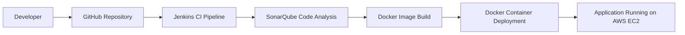

# 🚀End-to-End CI/CD Pipeline using Jenkins, SonarQube & Docker on AWS
A production-style CI/CD pipeline built using Jenkins, SonarQube, Docker, and AWS EC2 to automate the build, code quality analysis, containerization, and deployment process.  
This project demonstrates DevOps best practices, including automated pipelines, static code analysis, containerized deployments, and cloud infrastructure management.

## 📌Project Overview
This project implements a fully automated Continuous Integration and Continuous Deployment pipeline deployed on AWS cloud infrastructure.  
The pipeline automatically:  
- Pulls source code from GitHub  
- Performs static code analysis using SonarQube
- GitHub Webhooks for automatic pipeline triggers
- Builds a Docker image  
- Deploys the application inside a Docker container  
- Runs the application on a cloud-based infrastructure  
- The architecture is designed using multiple EC2 instances, simulating a real-world DevOps environment used in production systems.  

## 🏗 System Architecture

The CI/CD pipeline is built using three AWS EC2 instances, each responsible for a different service.  
### 1️⃣ Jenkins Server (CI/CD Engine)  
- Responsible for:  
- Automating build pipelines  
- Integrating with GitHub  
- Running CI/CD workflows  
- Triggering SonarQube analysis  
- Building Docker images  
- Deploying application containers  
### 2️⃣ SonarQube Server (Code Quality Analysis)  
- Used for static code analysis to detect:  
- Code smells  
- Security vulnerabilities  
- Bugs  
- Maintainability issues  
- This ensures clean, secure, and maintainable code before deployment.  
### 3️⃣ Docker Server (Deployment Server)  
- Hosts the Dockerized application  
- Ensures consistent runtime environment  
- Enables fast and scalable deployments  
### 🔄 CI/CD Pipeline Workflow  
- The automated pipeline follows the DevOps lifecycle:  

## ⚙️ Tech Stack  
- AWS-EC2  
- CI/CD-Jenkins  
- Code Quality-SonarQube  
- Containerization-Docker  
- Version Control-Git & GitHub  
- OS-Ubuntu Linux  
- Automation-Shell Scripts  

## ☁️ AWS Infrastructure
The infrastructure is deployed on Amazon Web Services (AWS).  
  
Component	Purpose  
EC2 Instance 1	- Jenkins CI/CD Server  
EC2 Instance 2	- SonarQube Server  
EC2 Instance 3	- Docker Deployment Server  
VPC	Secure virtual network  
Security Groups	Controlled network access  
  
## 📦 DevOps Concepts Demonstrated  
This project showcases several important DevOps engineering skills:  
- Continuous Integration (CI)  
- Continuous Deployment (CD)  
- Infrastructure on Cloud (AWS)  
- Static Code Analysis  
- Automated Build Pipelines  
- Containerization with Docker  
- Multi-server architecture  
- Deployment automation  
- Cloud-based DevOps workflows  
  
## 📸 Project Screenshots

### EC2 Instances – Jenkins, SonarQube, Docker

### Jenkins Pipeline Built for pulling code from Github and pushing to SonarQube

### SonarQube for Code Analysis

### Final Jenkins Pipeline after integrating Github, SonarQube, and Docker for Deployment

### Deployed Website

  

  

## 🎯 Key Learning Outcomes  
Through this project, I gained hands-on experience in:  
- Designing CI/CD pipelines using Jenkins
- Implementing GitHub Webhooks for automatic pipeline triggers
- Integrating SonarQube for automated code quality analysis
- Building and deploying Docker containers
- Managing cloud infrastructure using AWS EC2
- Automating the software delivery lifecycle

## 🚀 Future Improvements  
- Planned improvements to enhance this project:
- Implement Jenkins Pipeline as Code (Jenkinsfile)
- Store Docker images in AWS ECR
- Deploy containers using Kubernetes
- Add automated testing stage
- Integrate monitoring with Prometheus & Grafana
